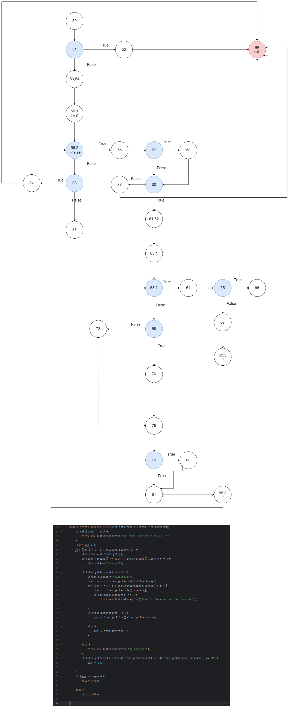
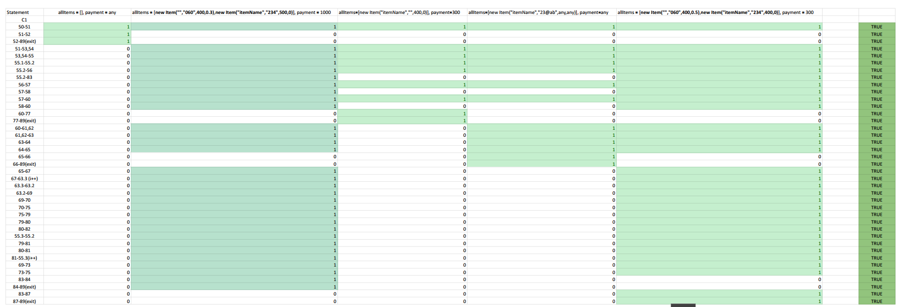
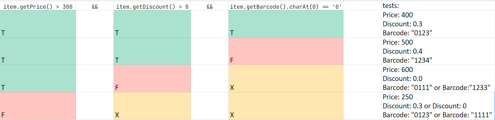

### Мила Кировски 223182

#### Control Flow Graph

#### Цикломатска комплексност
Цикломатската комплексност на овој код е **10**, истата ја добив преку формулата `P+1`, 
каде што _**P е бројот на предикатни јазли**_. Во случајoв P=9, па цикломатската комплексност изнесува 10.

#### Тест случаи според критериумот Every branch

[SI-lab2 - C1 - every branch.pdf](SI-lab2%20-%20C1%20-%20every%20branch.pdf)

#### Tест случаи според критериумот Multiple Condition 

Критериумот Multiple Condition вклучува тестирање на сите можни комбинации на условите за да се обезбеди сеопфатна покриеност.
Условите во if се:

`item.getPrice() > 300`
&&
`item.getDiscount() > 0`
&&
`item.getBarcode().charAt(0) == '0'`

Секој услов може да биде ТОЧЕН(Т) или НЕТОЧЕН(F), во случајов имаме 3 подуслови = 2^3 = 8.

X означува дека вредноста на неговото место може да биле Т или F.

[SI-lab2 - multiple-conditions-tests.pdf](SI-lab2%20-%20multiple-conditions-tests.pdf)

#### Објаснување на напишаните unit tests

##### Unit tests за Every branch:

Има 5 теста:
* `allItems = [], payment = any`

  * Се испраќа празна листа и било каква вредност за payment променливата, бидејќи листата е null програмата се очекува да фрли `RuntimeException`.
  
  
* `allItems = [new Item("","060",400,0.3),new Item("itemName","234",500,0)], payment = 1000`

  * Се испраќа листа со 2 елементи кои задоволуваат различни if услови.
  * Првиот елемент нема име (празна низа од знаци), па затоа ќе го задоволи условот каде на елементот ќе му се додени име 'unknown'. Исто така ќе се задоволат условите дека има вредност за Discount поголема од 0, цената на продуктот е поголема од 300 и неговиот баркод запоцнува со карактерот '0'. 
  * Вториот елемент има поинакви вредности од првиот, за да ги опфати спротивните услови.
  * Се очекува функцијата да врати `true`.

* `allItems=[new Item("itemName",null,400,0)], payment=300`
  * Се испраќа празна низа од знаци за баркодот на продуктот. Се осчекува функцијата да фрли `RuntimeException`.
  

* `allItems=[new Item("itemName","23@ab",any,any)], payment=any`
  * Се испраќа невалида низа од знаци за баркодот на продуктот. Се очекува функцијата да фрли `RuntimeException`.

* `allItems = [new Item("","060",400,0.5),new Item("itemName","234",400,0)], payment = 300`
  * Целата на овој тест случај е функцијата да врати спротивна вредност од првиот пример и се очекува функцијата да врати `false`.

